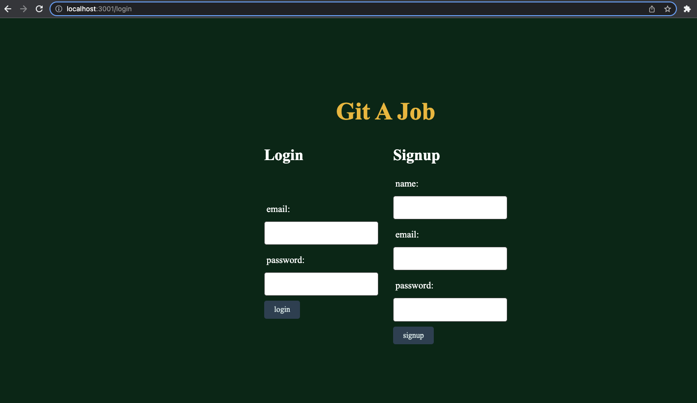
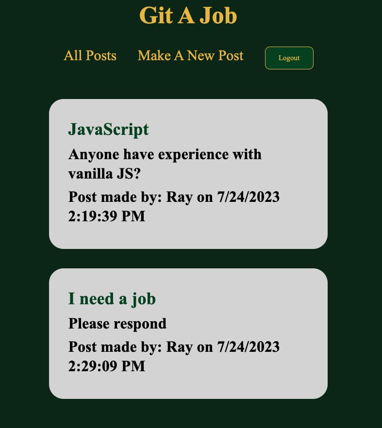
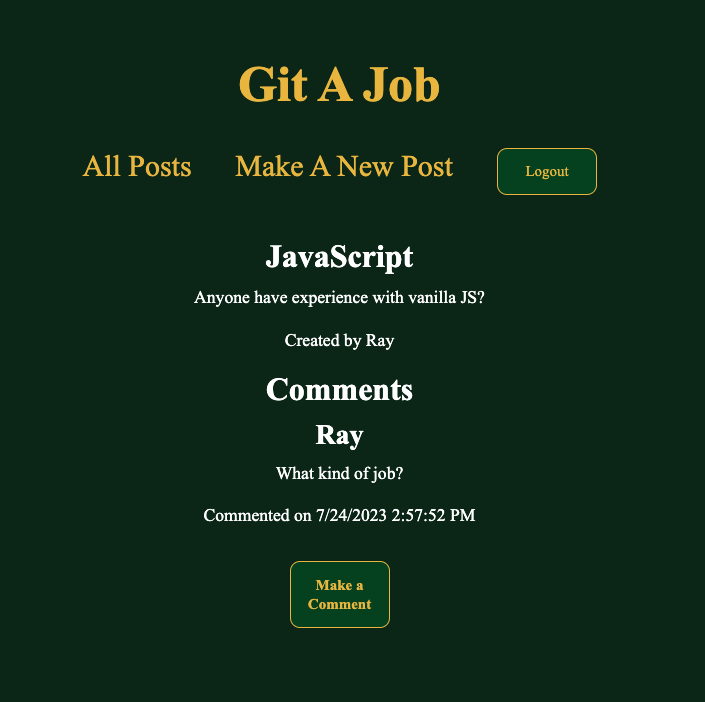

# Git a Job
> An application that web developers can use to post about anything related to their job search and comment on posts giving specific feedback to each individual’s need.
> Live demo [_here_](https://murmuring-sierra-21351-123e19ae1f23.herokuapp.com/login). <!-- If you have the project hosted somewhere, include the link here. -->

## Table of Contents
* [General Info](#general-information)
* [Technologies Used](#technologies-used)
* [Features](#features)
* [Screenshots](#screenshots)
* [Setup](#setup)
* [Usage](#usage)
* [Project Status](#project-status)
* [Room for Improvement](#room-for-improvement)
* [Acknowledgements](#acknowledgements)
* [Contact](#contact)
<!-- * [License](#license) -->

## General Information
If it is the first time to the site, the user will sign up with their name, email, and password to enter.  If the user has already signed up, they will login with their email and password.  Once logged in, all the posts that have been made will be displayed.  If they are the owner of the post, a delete button for that post will show so only they can delete it.  Then when an individual post is clicked on, it takes you to a page where the post is shown, comments made to that post are listed, and there is a clickable link to "Make a Comment."  When the "Make a Comment" link is clicked, the user can enter a comment to make on that post, and it will show up under the list of comments once it is submitted.  From there, the user can return to a list of all posts by clicking the "All Posts" link.
<!-- You don't have to answer all the questions - just the ones relevant to your project. -->

## Technologies Used
- Node.js
- Express.js
- Handlebars.js
- Express Session
- MySQL
- Sequelize ORM
- Dotenv
- Bcrypt

## Features
- Date and time stamps for posts and comments.
- Bcrypt hashes the password and if it matches, the user is able to login.
- Delete button only shows for the owner of that post.

## Screenshots

<!-- If you have screenshots you'd like to share, include them here. -->

## Setup
In order to get started with the project, the database name and MySQL username and password must be added in the .env file.  In the terminal, use the commands to invoke MySQL, source the schema, seed the database with the test data, and run the application.  Use any of the login information in user-seeds.js to login or sign up with your own name, email, and password.

## Usage

`npm i`

`mysql -u root -p`

`SOURCE db/schema.sql;`

`npm run seed`

`npm run start` 

## Project Status
Project is: _in progress_.

## Room for Improvement
- Add attachments like resumes/CV to a post.
- Like button for posts and comments.
- API for job listings.
- Use a search bar to filter by job categories.
- NODEMAILER!

## Acknowledgements
- Many thanks to our instructor, Michael Pacheco, the TAs, Nirav and Julius, and the tutors.

## Contact
Created by Kristine Kim, Kevin Lewis, Raymond Rodriguez, and Francisco Verdugo Del Real.  Feel free to contact us at kristinehkim@gmail.com, kplewis33@gmail.com, rodriguezraymond482@gmail.com, fco.verdugo9@live.com!

<!-- Optional -->
<!-- ## License -->
<!-- This project is open source and available under the [... License](). -->

<!-- You don't have to include all sections - just the one's relevant to your project -->